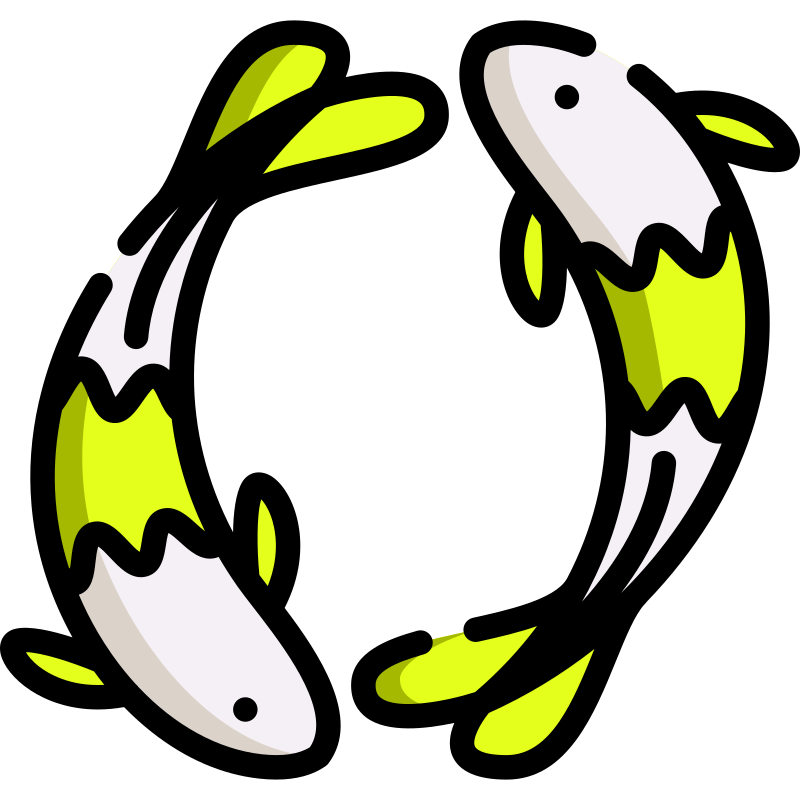

# Koi

<p align="center">
  
</p>

Koi is a simple T3 project that an online store that people can use to buy and sell items.

## Installation

To get started with Koi, you'll need to clone the repository and install its dependencies.

```bash
git clone *insert repo url here*
cd koi
pnpm install
```

## Usage

Once Koi is installed, you can start the development server by running the following command:

```bash
pnpm dev
```

## Contributing

If you'd like to contribute to Koi, please fork the repository and use a feature branch. Pull requests are welcome!

## Credits

The Koi logo is from [Svgrepo](https://www.svgrepo.com/svg/300501/koi).

## License

Koi is licensed under the MIT license. See LICENSE.txt for more information.

## Contact

If you have any questions or feedback about Koi, please feel free to reach out to me on twitter @mazenwrld.
